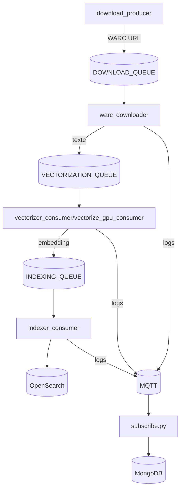

# Ysearch Process

Ce dépôt rassemble plusieurs scripts Python permettant de télécharger des pages web au format WARC, de les vectoriser puis de les indexer dans OpenSearch. L'orchestration se fait à l'aide de RabbitMQ pour que chaque étape soit indépendante.

## Présentation générale
- **download_producer.py** publie dans RabbitMQ les URLs des fichiers WARC à récupérer.
- **warc_downloader.py** télécharge ces fichiers, extrait le texte français et envoie les pages à vectoriser.
- **vectorizer_consumer.py** ou **vectorize_gpu_consumer.py** transforme le texte en embeddings.
- **indexer_consumer.py** stocke les embeddings dans OpenSearch.
- **subscribe.py** enregistre dans MongoDB les métriques publiées par `logger.py`.

Les services RabbitMQ, MongoDB et OpenSearch peuvent être lancés via `docker-compose.yml`.

## Schéma d'architecture


## Configuration rapide
1. Installez les dépendances :
   ```bash
   pip install -r requirements.txt
   ```
2. Créez un fichier `.env` à la racine contenant au minimum :
   ```env
   RABBITMQ_HOST=localhost
   RABBITMQ_USER=user
   RABBITMQ_PASSWORD=password
   VECTORIZATION_QUEUE=vector_queue
   INDEXING_QUEUE=index_queue
   DOWNLOAD_QUEUE=download_queue
   ES_HOSTS=['http://localhost:9200']
   ES_INDEX=ysearch
   ```
3. Lancez les services nécessaires (RabbitMQ, MongoDB, OpenSearch) :
   ```bash
   docker compose -f docker-compose.yml up -d
   ```

## Fichiers et utilisation
| Fichier | Description | Lancement |
|---------|-------------|-----------|
| `download_producer.py` | Lit les URLs WARC depuis `path.paths` et les publie dans `DOWNLOAD_QUEUE`. | `python download_producer.py` |
| `warc_downloader.py` | Télécharge chaque fichier WARC, extrait le texte français et publie dans `VECTORIZATION_QUEUE`. | `python warc_downloader.py` |
| `vectorizer_consumer.py` | Vectorise le texte avec un modèle CPU et publie dans `INDEXING_QUEUE`. | `python vectorizer_consumer.py` |
| `vectorize_gpu_consumer.py` | Variante GPU fonctionnant par lots. | `python vectorize_gpu_consumer.py` |
| `indexer_consumer.py` | Indexe les embeddings dans OpenSearch. | `python indexer_consumer.py` |
| `producer.py` | Exemple de publication de pages locales sans passer par le downloader. | `python producer.py` |
| `subscribe.py` | Consomme les messages MQTT produits par `logger.py` et les stocke dans MongoDB. | `python subscribe.py` |
| `sequencer.py` | Fonction utilitaire pour découper le texte avant vectorisation. | importé par d'autres scripts |
| `logger.py` | Publie les métriques sur MQTT. | utilisé en interne |
| `config.py` | Charge toutes les variables d'environnement. | importé par tous les scripts |
| `docker-compose.yml` | Lance RabbitMQ, MongoDB et OpenSearch en mode simple. | `docker compose up -d` |
| `struct.docker-compose.yml` | Exemple de déploiement avec plusieurs nœuds RabbitMQ. | `docker compose -f struct.docker-compose.yml up -d` |
| `dockerfile` | Image Docker pour packager les scripts. | `docker build -t ysearch .` |

Ces scripts forment ensemble le pipeline complet de collecte et d'indexation.
